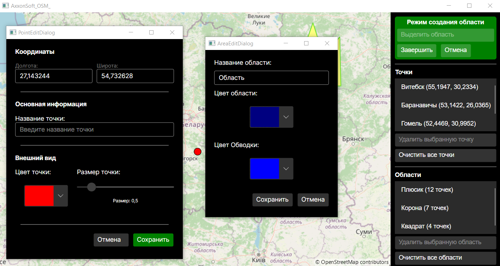
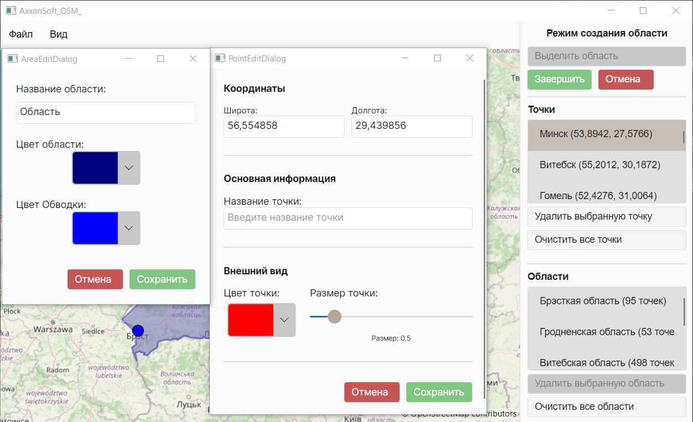

# Приложение с интерактивной картой

## В паланах
* Добавить кнопки для на ведения на область, точку и для смены темы приложения

## Приложение

### Все формы в темной теме

### Все формы в светлой теме

## Цель
Создать desktop приложение на Avalonia, .net8, которое отображает карту (OSM) и позволяет пользователю выделять области на ней.

## Функциональные требования
1) Отображение карты
   * ☑ Приложение должно показывать карту с возможностью масштабирования и перемещения.
   * ☑ При повторном запуске приложение должно открываться на той же области карты, где пользователь завершил предыдущую сессию.
2) Выделение областей
   * ☑ Пользователь должен иметь возможность отмечать точки на карте и соединять их в замкнутую область.
   * ☑ На карте может быть несколько таких областей.
   * ☑ При масштабировании карты нарисованные области должны изменяться пропорционально.
3) Сохранение данных
    * ☑ Все созданные области должны сохраняться при закрытии приложения.
    * ☑ При следующем запуске они должны автоматически загружаться и отображаться.
4) Панель со списком областей
    * ☑ Справа от карты должна отображаться панель со списком всех созданных областей.
    * ☑ В списке должны быть названы все области.
    * ☐ Пользователь должен иметь возможность удалить область или выбрать её для отображения на карте.

## Дополнительное
* Добавить возможность создания разноцветных меток и областей
* Сделать сохранение камеры, областей и точек в JSON файле
* Есть две темы(светлая и темная) что бы у всех интерфейс отображался корректно
* Точки нельзя было ставить за пределами карты